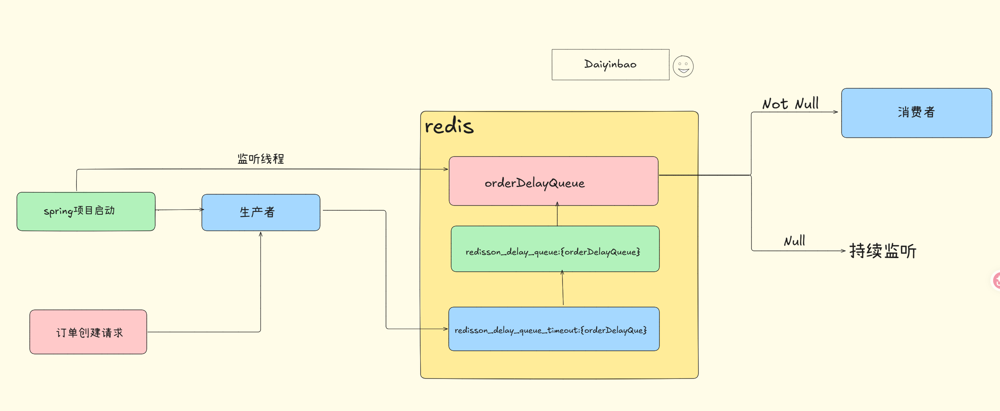

# 一.⏳ 基于 Redis（Redisson）的分布式延时任务实现

本项目基于 **Redis + Redisson DelayQueue** 实现一个轻量级分布式延时任务系统，适用于：

- ⏱ 订单超时自动关闭
- 💳 支付超时自动取消
- 📦 自动确认收货
- 🔁 延时补偿机制
- 🔒 分布式环境安全执行

------

# 二.📌 技术架构说明

本延时任务方案基于以下核心技术实现：

- Redis ZSet（时间排序）
- Redis List（阻塞队列）
- Lua 脚本（原子操作）
- Redisson RDelayedQueue
- 业务消费者线程

------

# 三.🔧 核心 Redis 结构

使用 Redisson 延时队列时，底层涉及三个 Redis 结构：

| 结构名                                 | 类型 | 作用             |
| -------------------------------------- | ---- | ---------------- |
| `redisson_delay_queue_timeout:{queue}` | ZSet | 存储任务到期时间 |
| `redisson_delay_queue:{queue}`         | List | 内部调度结构     |
| `{queue}`（如 orderDelayQueue）        | List | 业务消费阻塞队列 |

------

# 四.🚀 执行流程说明*



## 1️⃣ 生产者添加延时任务

```java
RBlockingQueue<Long> blockingQueue = redissonClient.getBlockingQueue("orderDelayQueue");

RDelayedQueue<Long> delayQueue = redissonClient.getDelayedQueue(blockingQueue);

delayQueue.offer(orderId, 30, TimeUnit.SECONDS);
```

执行逻辑：

- 计算任务到期时间
- 写入 Redis ZSet
- Redisson 内部调度线程开始监听

------

## 2️⃣ Redisson 内部调度线程

Redisson 内部会：

- 监听 ZSet 最小 score
- 判断是否到期
- 若到期执行 Lua 脚本：
  - 从 ZSet 删除
  - 推入业务阻塞队列

Lua 保证整个搬运过程原子性，避免重复执行。

------

## 3️⃣ 业务消费者线程

```java
private ExecutorService consumerExecutor = Executors.newSingleThreadExecutor();

consumerExecutor.submit(() -> {
    RBlockingQueue<Long> blockingQueue = redissonClient.getBlockingQueue("orderDelayQueue");
    while (true) {
        Long orderId = blockingQueue.take();
        orderService.handleExpireOrder(orderId);
    }
});
```

底层对应 Redis 命令：

```bash
BLPOP orderDelayQueue 0
```

特点：

- 队列为空时自动阻塞
- 有数据自动唤醒
- 不占用 CPU

------

# 五.🧠 线程模型说明

系统包含两类线程：

### 业务消费者线程

- 监听阻塞队列
- 执行业务逻辑

### Redisson 内部调度线程

- 监听延时 ZSet
- 到期后搬运任务
- 使用 Lua 保证原子性

# 六.🛡 生产环境注意事项

## ✅ 必须开启 Redis 持久化

建议使用：

- AOF（推荐）
- 或 RDB

否则 Redis 重启会丢失延时任务数据。

------

## ✅ 业务必须保证幂等

延时任务可能出现：

- 重试
- 补偿重复执行

建议：

- 通过订单状态判断
- CAS 更新
- 数据库唯一索引控制

------

## ✅ 时间同步

延时任务 score 基于系统时间。

必须保证：

```http
所有服务器开启 NTP 时间同步
```

否则可能导致延时不准确。

------

## ✅ 大规模优化建议

如果延时任务量较大：

- 按业务拆分多个队列
- 分片 ZSet
- 分页补偿扫描
- 控制单个 ZSet 规模

# 七.📦 项目结构示例

```http
delay-task/
 ├── config/
 ├── service/
 ├── consumer/
 ├── compensation/
 └── README.md
```

# 🧪 典型应用场景

- 订单 30 分钟未支付自动关闭
- 支付超时取消
- 优惠券到期处理
- 延时重试机制

------

# 🏁 总结

该方案实现简单、性能高、分布式安全，
 适用于大多数中小规模延时任务场景。

通过：

- 持久化保障
- 分布式锁控制
- 幂等设计

可以达到生产级可靠性。